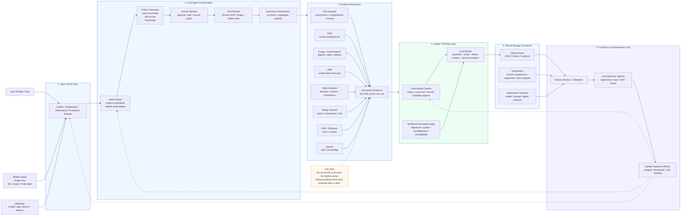

# Agent-Based Multimodal Eval Demo

Image-first demo for an agentic evaluation system based on `agent_based_multimodal_eval_system_v2.md`.



## Demo Paths

```text
User requirements
  -> rubric_generator.py
  -> draft rubric
  -> human edit / approve
  -> eval run
```

```text
DiffusionDB sample
  -> dataset_importer.py
  -> eval case
  -> evidence extraction
  -> score + report
```

```text
Image output
  -> image analyzer + OCR + safety checker
  -> hard checks + soft scores
  -> reports/<case_id>/result.json
```

## Run

```bash
python3 runner.py \
  --case cases/golden/golden_image_001.json \
  --rubric configs/rubrics/image_generation_general_v1.yaml
```

```bash
python3 runner.py \
  --case cases/golden/diffusiondb_geodesic_landscape_001.json \
  --rubric configs/rubrics/generated_diffusiondb_art_v1.yaml
```

```bash
python3 rubric_generator.py \
  --requirements "Evaluate image outputs for prompt alignment, visual coherence, safety, and user acceptability." \
  --rubric-id custom_image_art_v1 \
  --name "Custom Image Art Rubric" \
  --output configs/rubrics/custom_image_art_v1.yaml
```

```bash
python3 dataset_importer.py \
  --dataset diffusiondb \
  --output cases/golden/diffusiondb_geodesic_landscape_001.json
```

## Dataset

```text
DiffusionDB
  -> text-to-image prompt/image dataset
  -> https://huggingface.co/datasets/poloclub/diffusiondb
  -> https://poloclub.github.io/diffusiondb/
```

## Test

```bash
python3 -m unittest discover tests
```
